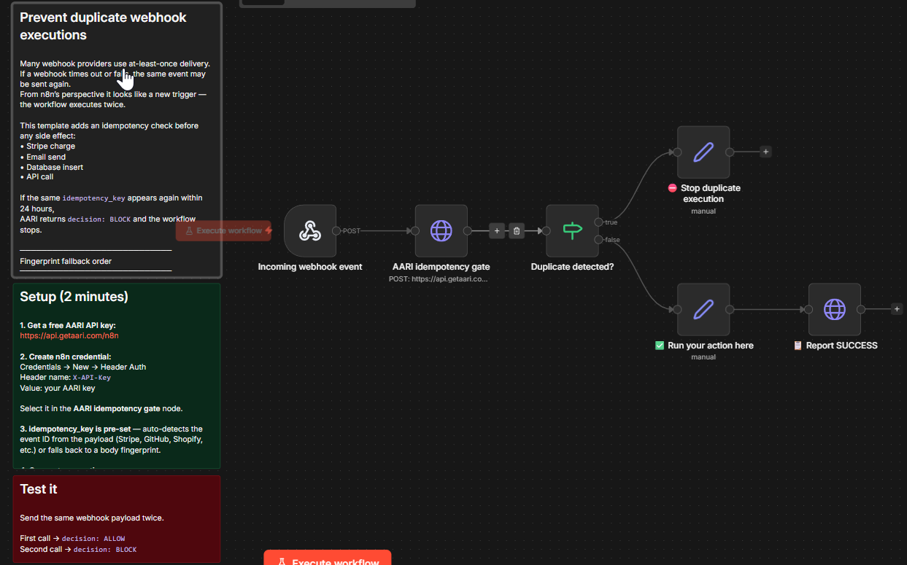
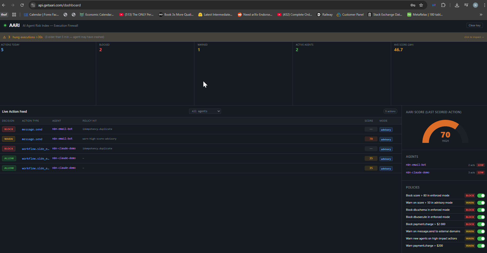

# Prevent duplicate webhook executions in n8n

[](https://github.com/aari-ai/n8n-webhook-idempotency)
[](https://api.getaari.com/n8n-template)
[](LICENSE)
[](https://api.getaari.com/n8n)



Webhook providers use **at-least-once delivery**. If a request times out or fails, the provider retries — and your workflow executes twice. The same Stripe charge runs again. The same confirmation email goes out again.

This template adds an idempotency gate before any side effect. The first event goes through. Retries are caught and stopped.

---

## Import workflow

Download and import into n8n — expressions evaluate automatically, no manual configuration after import:

**[⬇ Download n8n workflow](https://api.getaari.com/n8n-template)**

Or from this repo: [`workflows/prevent-duplicate-webhook-executions.json`](workflows/prevent-duplicate-webhook-executions.json)

**Direct raw JSON** (import without downloading):
```
https://raw.githubusercontent.com/aari-ai/n8n-webhook-idempotency/main/workflows/prevent-duplicate-webhook-executions.json
```

---

## Quick start (2 minutes)

**1. Import the workflow** — [download here](https://api.getaari.com/n8n-template)

**2. Get a free AARI API key** — [https://api.getaari.com/n8n](https://api.getaari.com/n8n) · free · 2,500 gate calls/month · no credit card

**3. Create a credential in n8n**

Credentials → New → **Header Auth**
- Header name: `X-API-Key`
- Value: your AARI key

Select it in the **AARI idempotency gate** node.

**4. Connect your action**

Replace **✅ Run your action here** with your real action — Stripe charge, send email, DB insert, API call.

---

## How it works

```
Webhook provider
      │
      ▼
 n8n Webhook node  ──── responds 200 OK immediately (no retry loops)
      │
      ▼
 AARI Gate API  ◄──── checks key against Redis (24h window)
      │
      ├── first seen ──► ALLOW ──► your action ──► report SUCCESS
      │
      └── duplicate  ──► BLOCK ──► workflow stops ──► report BLOCKED
```

1. The AARI gate checks the event's idempotency key against a 24-hour window.
2. First seen → `ALLOW` → action runs → outcome recorded as `SUCCESS`.
3. Retry → `BLOCK` → workflow stops → outcome recorded as `BLOCKED`.

The Webhook node uses **Respond immediately** — `200 OK` goes back to the provider before the workflow runs. No retry loops caused by slow execution.

---

## Idempotency key examples

The key is pre-set and auto-detects the event ID. No manual configuration needed.

| Provider | Resolved key |
|----------|-------------|
| Stripe | `$json.id` → `evt_1234...` |
| GitHub | `$json.id` → `push_5678...` |
| Shopify | `$json.id` → `order_9012...` |
| Generic (no id field) | `$json.type`:`$json.created` |

The fallback chain: `body.id` → `event_id` → `eventId` → `webhook_id` → header `x-event-id` → body fingerprint → `execution.id` (last resort, not retry-safe).

---

## What happens when a duplicate event arrives

The first event is allowed through. The retry is blocked before any side effect runs.



| Event | Decision | Outcome |
|-------|----------|---------|
| First delivery | ALLOW | SUCCESS |
| Retry / duplicate | BLOCK | BLOCKED |

Zero PENDING in normal runs.

---

## Why not just use the Remove Duplicates node?

n8n's built-in Remove Duplicates node only deduplicates **within a single execution**.

Webhook retries arrive as **new executions** — the Remove Duplicates node has no memory of the previous run. By the time the retry lands, the first execution is already gone.

This template stores the idempotency key **externally** (24-hour Redis window), so retries are caught before any side effect runs — regardless of execution boundaries.

---

## Works with

Stripe · GitHub · Shopify · WooCommerce · any webhook provider using at-least-once delivery.

---

## Documentation

- [n8n quickstart](docs/n8n-quickstart.md)
- [Choosing idempotency keys](docs/idempotency-keys.md)
- [API reference](https://api.getaari.com/docs#n8n)

---

## Keywords

n8n webhook duplicate · n8n idempotency · prevent duplicate workflow execution · webhook retries n8n · stripe webhook duplicate · n8n webhook runs twice · at-least-once delivery n8n · n8n deduplication · shopify webhook duplicate · github webhook duplicate

---

**Get a free key + import workflow: [https://api.getaari.com/n8n](https://api.getaari.com/n8n)**

---

⭐ If this template saved you from a duplicate webhook execution, consider starring the repo — it helps others find it.
